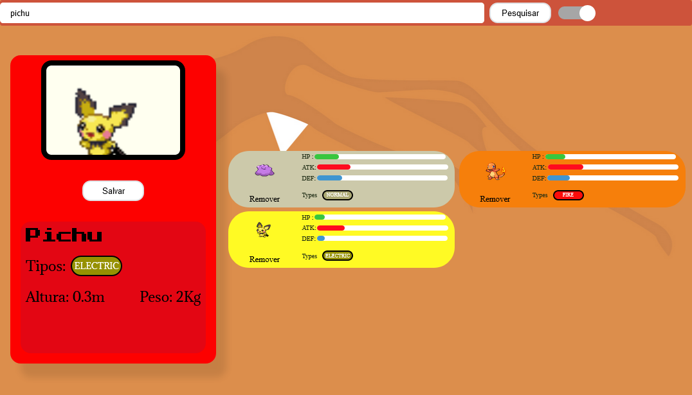
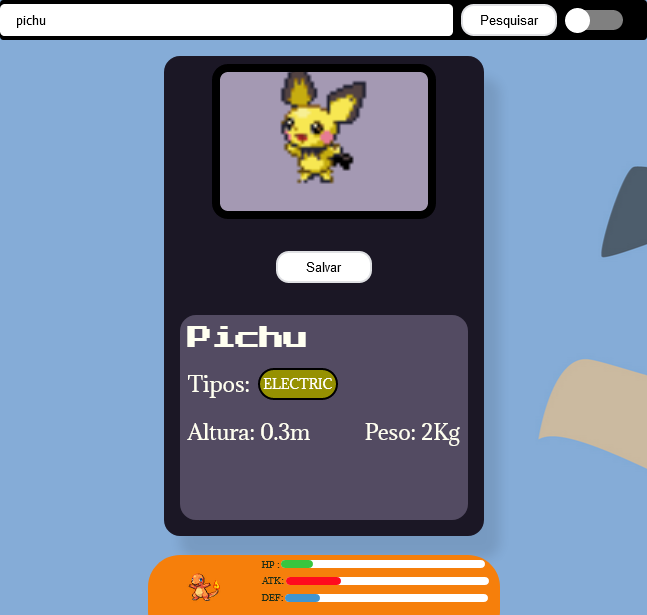

# WikiDex em React

Esse é um projeto pessoal que decidi fazer consumindo a [pokeapi](https://pokeapi.co/), ainda pretendo adicionar algumas funcionalidades e páginas adicionais no futuro, mas neste momento você pode usar para obter um resumo de qualquer pokémon e ainda criar uma lista de até 10 pokemons e ver uma comparação de seus status.

Caso deseje você pode testar esse projeto em produção pode fazer [clicando aqui](https://wikidex-pokemon.vercel.app/).

## Imagens do projeto

<p align="center">


</p>


## Tecnologias e conceitos utilizados
- **ReactJS**
- **Context API**
- **Styled Components**

## Funcionalidades

Nesse projeto você pode:

- Pesquisar por um Pokemon via Id ou Nome
- Salvar uma lista de pokemons
- Alternar entre tema claro e escuro

### Funcionalidades e Modificações Futuras

Como mencionei ainda pretendo adicionar umas funcionalidades nesse projeto, meus planos até então são de adicionar:
 * Converter para TypeScript
 * Salvar o tema escolhido no localStorage
 * Página com mais informações de um pokemon selecionado
 * Navegação Usando o **React Router Dom**


## Como rodar o projeto

Primeiro clone ou baixe o repositório, para isso você pode usar os comandos:


```bash
git https://github.com/Martvie/wikidex-pokemon.git
cd wikidex-pokemon/

```

Se usa o VsCode e ele não está aberto você pode iniciar a ferramenta direto na pasta raiz usando:
```bash
code .
```
Depois disso para instalar as dependências do projeto use o comando `yarn`, claro você pode usar o `npm` se preferir, mas como usei o `yarn` recomendo que use ele ao menos nesse projeto:
Para instalar use:
```bash
yarn
```
E quando instaladas use:
```bash
yarn start
```
Quando quiser encerrar o processo é só usar as teclas **ctrl + c** no terminal.


    
## Aprendizados

Com esse projeto pude de fato aprender como funciona a context API, e me diverti ~~depois de passar raiva é claro~~ usando a própria context do React para estilizar um tema claro e escuro da aplicação, nesse projeto também pude me aprofundar um pouco na biblioteca styled components e acredito ter extraído mais potencial dela se comparado a meus projetos anteriores.

## Autor

- [@Martvie](https://github.com/Martvie)


## Stack utilizada

**Front-end:** React

